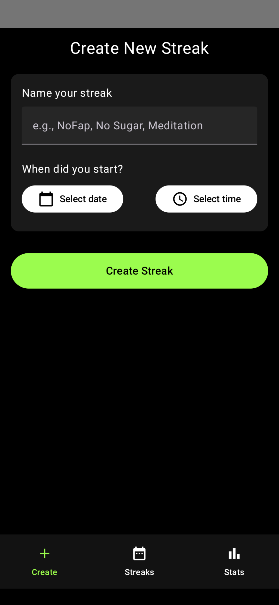
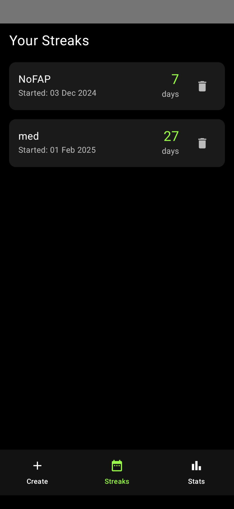
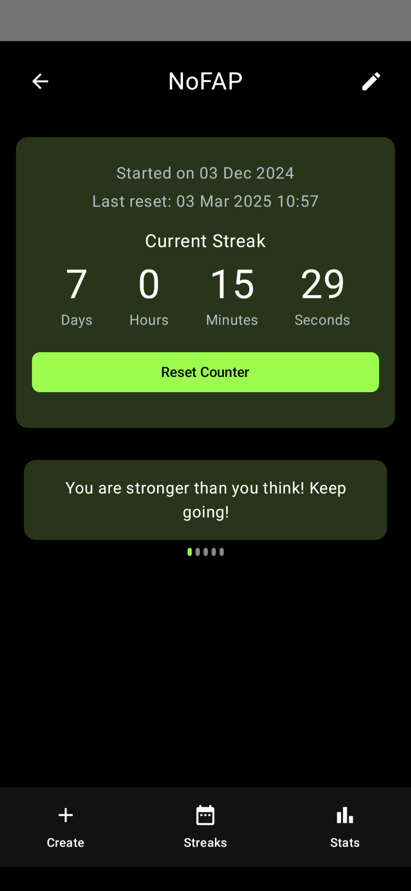
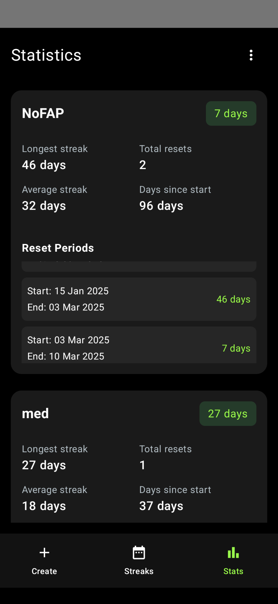

# StreakMaster

An Android streak tracking app built with Jetpack Compose. Track your habits, view small statistics, and maintain your streaks with a sleek, simple UI.

## Features
- Create and manage streaks
- View detailed statistics (longest streak, resets, reset periods, etc.)
- Chart for streak observance (In progress)
- Delete streaks with confirmation
- Export and Import streak data (as JSON)

## Screenshots

| Create Streak                  | Streak Lists                  |
|--------------------------------|-------------------------------|
|  |  |




## Customize
1. Clone the repo and build from Android Studio:
   ```bash
   git clone https://github.com/bl4ckspid3r/StreakMaster.git